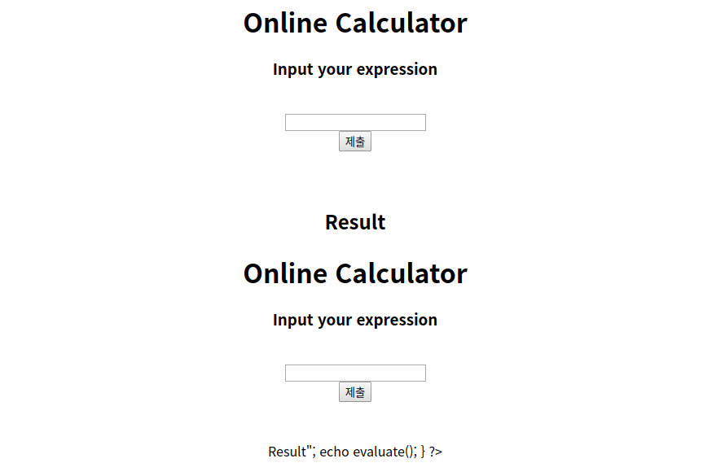
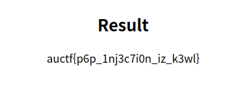

# Quick Maths
**Web, 50pts**
> two plus two is four minus three that's one quick maths

--------------------------------------------------------------------------------


계산식을 입력하면 결과가 하단에 출력된다. 오류를 발생시키기 위해 `'`를 입력해보니 아래와 같은 오류를 확인할 수 있었다.

```
Parse error: syntax error, unexpected '';' (T_ENCAPSED_AND_WHITESPACE) in /var/www/html/index.php(5) : eval()'d code on line 1
```

`eval` 함수가 사용된 것을 보고 시스템 함수를 이용하여 플래그 파일이 있는지 확인해봤다. 문제를 처음 풀 때에는 `flag`라는 이름의 파일이 있었던 것으로 기억하는데, 그 파일에는 플래그가 없었다. 상위 디렉토리도 확인해봤지만 플래그는 찾을 수 없었다. 그래서 문제 파일을 출력해보니 PHP 코드 일부가 잘려서 읽을 수 있었다.



페이지 소스 코드를 확인해보니 `flag` 변수에 플래그가 정의된 것을 확인할 수 있었다.

```php
<?php
function evaluate(){
	$in = "echo " . $_POST['statement'] . ";";
	$flag = "auctf{p6p_1nj3c7i0n_iz_k3wl}";
	$value = eval($in);
	return $value;
}
?>

...

<?php
if (isset($_POST['statement'])){
		echo "<h2>Result</h2>";
		echo evaluate();
}
?>
```



```
Flag: auctf{p6p_1nj3c7i0n_iz_k3wl}
```