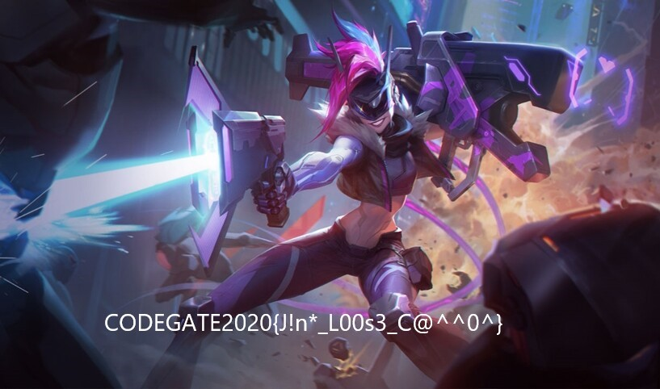

# CODEGATE 2020 CTF
Preliminary Round
- ENIGMA
- LOL

## ENIGMA
```
DON'T LET YOUR RIGHT HAND KNOW WHAT YOUR LEFT HAND DID
5+,'( "2( )+-3 r-/:( :*,5 ',+1 1:*( )+3 "26( :*,5 5-d


ONCE A HACKER IS AN ETERNAL HACKER
+,92 * :*9'23 -4 *, 2(23,*" :*9'23


A HACKER WITHOUT PHILOSOPHY IS JUST AN EVIL COMPUTER GENIUS
* :*9'23 1-(:+-( @:-"+4+@:) -4 ;_4( *, 2?-" 9+.@_(23 /2,-_4

flag is :
9+52/*(22020{:*9'234 *32 ,+( !+3, +,") -( -4 .*52}
```

알파벳과 문자들이 일대일로 매칭되어 있다. 맨 아래에 주어진 플래그를 위의 규칙을 따라 변환하면 플래그를 획득할 수 있다. 하지만 한 글자가 존재하지 않아서 추측하여 플래그를 완성했다.

```
CODEGATE2020{HACKERS ARE NOT BORN ONLY IT IS MADE}
```

## LOL
> Find the key in gif file

GIF 파일이 있지만 사진을 열어 볼 수는 없었다. 헥스 에디터로 열어 맨 위의 파일 시그니처를 확인하니 JPG 형식이었고, 파일 내에서 해당 파일 시그니처를 검색해보니 여러 개의 사진 파일이 합쳐져 있다는 것을 알 수 있었다. 각각을 원래의 파일로 나눠 저장하니 게임 '리그 오브 레전드'의 챔피언 사진이었다. 그 중에서 플래그가 적혀 있는 파일을 확인하였다.



```
CODEGATE2020{J!n*_L00s3_C@^^0^}
```