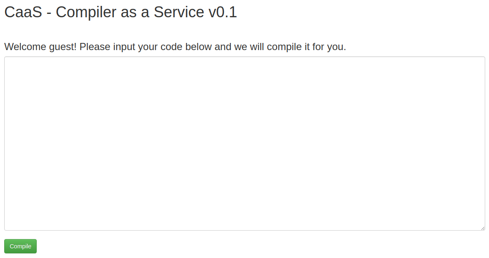

# CaaS
**Web, 100pts**
> Compiler as a Service
>
> Too lazy to install gcc? Hey, we can compile your code to you!
>
> `flag is on /flag`
>
> https://caas.fireshellsecurity.team/



문제 설명을 보니 C 코드를 작성하면 컴파일해주는 것으로 보인다. 간단하게 코드를 작성해보니 실행 파일로 반환되었다. 파일 입출력을 통해 서버의 `/flag` 파일을 포함할 수 있을까 해서 코드로 작성해봤지만 실행 파일은 사용자의 로컬에서 파일을 읽기 때문에 불가능했다.

그래서 컴파일 할 때 `/flag`를 `include`하면 실행 파일에 포함될 것으로 판단하였다. 하지만 정상적으로 컴파일이 불가능했고 이와 관련된 오류가 출력되었다.


오류 내용에서 이 문제의 플래그를 확인할 수 있었다.

```
F#{D1d_y0u_1nclud3_th3_fl4g?}
```