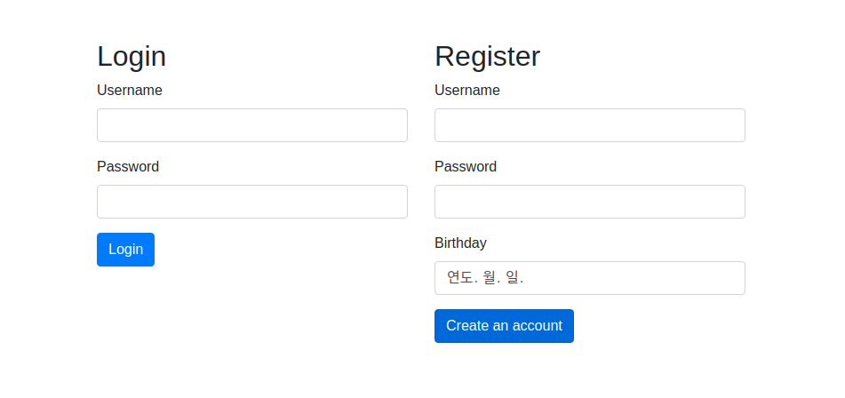
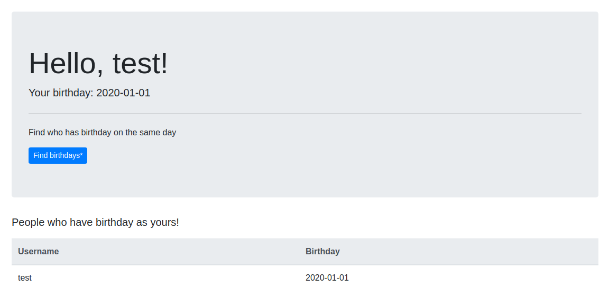
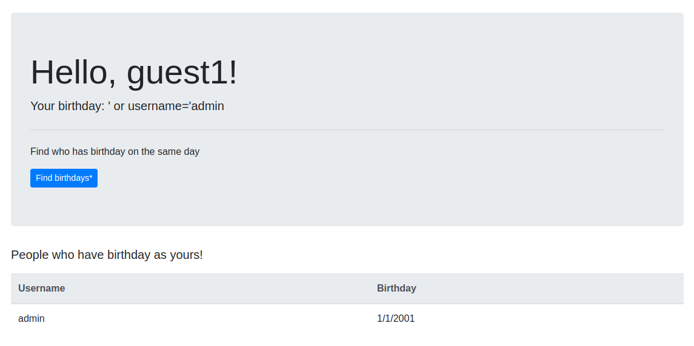
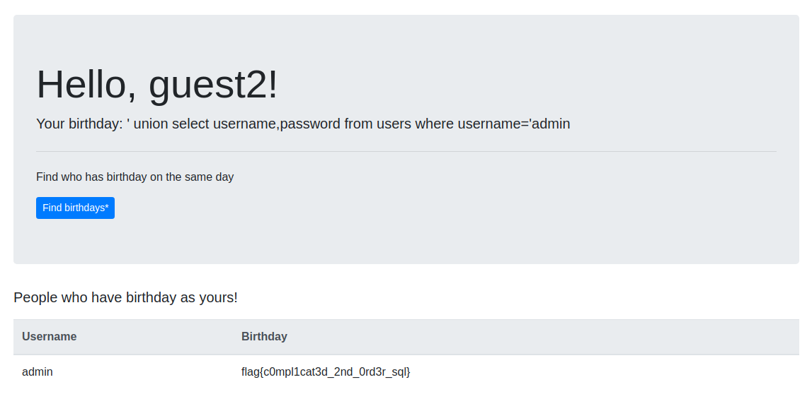

# Online Birthday Party
**Web, 316pts**
> This pandemic hit everybody hard. Especially, those who want to make a birthday party. That is why we decided to create a website where you can find those who have the same birthdate as yours. Check it out: https://online-birthday-party.cha.hackpack.club/

--------------------------------------------------------------------------------




회원가입 후에 로그인하면 프로필 화면으로 이동한다. 아래의 사진과 같이 프로필 화면에서 Find birthday 버튼을 눌러 생년월일이 동일한 사람들의 정보를 확인할 수 있다.



일단 로그인 할 때 SQL Injection이 가능한지 쿼터와 주석 문자를 입력해봤는데 오류가 Fetch failed라고만 출력되었다. 싱글쿼터를 포함하여 회원가입을 하고 로그인해서 프로필 화면에 출력되는 이름을 확인해보니 싱글쿼터가 그대로 출력되었다. Username과 Password를 입력받는 부분은 필터링되는 것으로 보였다.

```
Query failed: SELECT username, bday FROM users WHERE bday = ''';
```

남은 부분은 생년월일이었다. Burp를 이용하여 생년월일을 `'`로만 입력하니 위와 같은 오류가 발생하였다. 인젝션이 가능한 것을 확인하고 오류에 출력된 쿼리문을 통해 페이로드를 작성하기로 했다. 일단은 admin 계정이 존재하는지 확인해봤다.



사용한 페이로드는 생일에서 확인할 수 있다. 사실 이렇게 확인하기 전에 admin으로 회원가입을 해봤으면 계정 존재 여부를 미리 확인할 수 있었는데, 불필요한 작업을 했다는 것을 나중에 알았다. admin으로 회원가입을 시도하면 다음과 같은 오류가 출력된다.

```
Statement execution failed: Duplicate entry 'admin' for key 'unique_username'
```

다음은 admin 계정의 비밀번호를 알아내기 위해 UNION SELECT문을 이용하여 생일 위치에 비밀번호를 출력하고자 하였다. 생년월일에 입력한 페이로드가 정상적으로 동작하면 다음과 같은 쿼리문을 구성하게 될 것이다.

```sql
SELECT username, bday FROM users WHERE bday = '' UNION SELECT username, password FROM users WHERE username='admin';
```



출력된 결과를 통해 비밀번호가 플래그였다는 것을 알 수 있었다. 

```
Flag: flag{c0mpl1cat3d_2nd_0rd3r_sql}
```