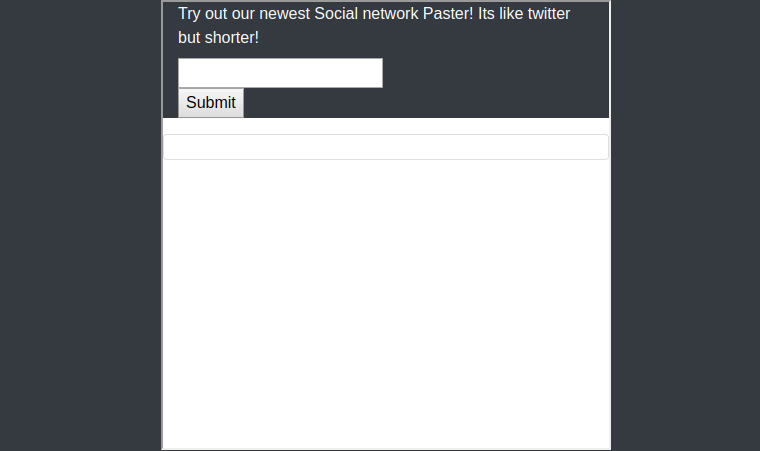

# Paster
**Web, 100pts**
> Come and BETA Test our new social networking site. Its like twitter but shorter
>
> https://paster.cha.hackpack.club/

--------------------------------------------------------------------------------



텍스트를 입력하면 글이 등록된다. `iframe` 위에 `frames/index.php` 파일이 실행되고 있어서 해당 경로로 이동해보니 `game-frame.js` 파일이 있었다. 스크립트가 `[]()!!`로만 구성되어 있는 **JSFuck** 스타일이었다. 디코딩하여 아래와 같은 코드를 얻었다.

```js
parent.postMessage(window.location.toString(), "*");
var originalAlert = window.alert;
window.alert = function (t) {
    parent.postMessage("success", "*"), flag = atob("ZmxhZ3t4NTVfaTVOdF83aEE3X2JBRF9SMUdoNz99"), setTimeout(function () {
        originalAlert("Congratulations, you executed an alert:\n\n" + t + "\n\nhere is the flag: " + flag)
    }, 50)
};
```

플래그 변수에 base64 인코딩된 값이 있어서 이것을 디코딩하여 플래그를 획득할 수 있었다.

```
Flag: flag{x55_i5Nt_7hA7_bAD_R1Gh7?}
```