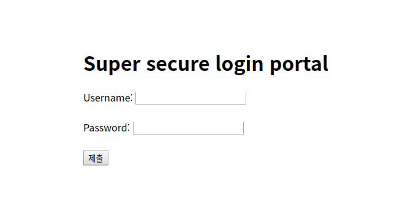
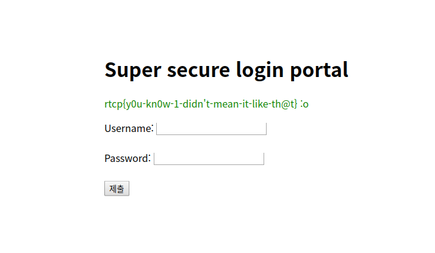

# I don't like needles
**Web, 50pts**
> They make me SQueaL!
> 
> http://challs.houseplant.riceteacatpanda.wtf:30001
> 
> Dev: Tom

--------------------------------------------------------------------------------



페이지 소스 코드를 보니 PHP 코드를 확인할 수 있었다.

```php
<?php
    if ($_SERVER['REQUEST_METHOD'] == "POST") {
        require("config.php");

        if (isset($_POST["username"]) && isset($_POST["password"])) {
            $username = $_POST["username"];
            $password = $_POST["password"];

            if (strpos($password, "1") !== false) {
                echo "<p style='color: red;'>Auth fail :(</p>";
            } else {
                $connection = new mysqli($SQL_HOST, $SQL_USER, $SQL_PASS, $SQL_DB);
                $result = mysqli_query($connection, "SELECT * FROM users WHERE username='" . $username . "' AND password='" . $password . "'", MYSQLI_STORE_RESULT);
                    
                if ($result === false) {
                    echo "<p style='color: red;'>I don't know what you did but it wasn't good.</p>";
                } else {
                    if ($result->num_rows != 0) {
                        if (mysqli_fetch_array($result, MYSQLI_ASSOC)["username"] == "flagman69") {
                            echo "<p style='color: green;'>" . $FLAG . " :o</p>";
                        } else {
                            echo "<p style='color: green;'>Logged in :)</p>";
                        }
                    } else {
                        echo "<p style='color: red;'>Auth fail :(</p>";
                    }
                }                    
            }
        }
    }
?>
```

`username`이 `flagman69`일 때 플래그가 출력되는 것을 알 수 있다. Username에 `flagman69'#`, Password에 임의의 값을 넣어주면 조건을 모두 만족하여 플래그를 획득할 수 있다.



```
Flag: rtcp{y0u-kn0w-1-didn't-mean-it-like-th@t}
```