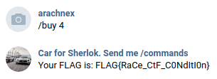

# Car for Sherlock
> While chasing a serial killer Sherlock Holmes stopped a wrong person. Now, thanks to my « bot », you can buy a car for Sherlock, so he doesn’t have to run chasing taxis anymore.

문제의 링크를 누르면 러시아의 SNS인 브콘탁테(vk.com)로 접속된다. 회원가입을 하고 `/commands`라고 메시지를 보내면 다음과 같이 답장이 온다.

`commands`는 입력할 수 있는 명령어를 보여준다.

`stat`은 나에 대한 정보를 보여준다.

`product`는 상품에 대한 정보를 보여준다. `buy` 명령어를 통해 상품 구매가 가능하고, `sell` 명령어를 통해 현재 보유하고 있는 상품을 판매할 수 있다.

플래그를 획득하기 위해서는 4번 상품을 구매해야 한다. 하지만 플래그의 가격은 101로, 보유하고 있는 돈이 100이기 때문에 구매가 불가능하다. 물론 구입한 물건을 두 번 판매할 수 있다면 돈이 200이 되기 때문에 구매가 가능해진다. 여기서 Race Condition 공격이 떠올랐다. 첫 번째 `sell` 명령어가 처리되기 전에 두 번째 `sell` 명령어를 전달하여 거의 동시에 처리되도록 하면 될 것이다.

처음에는 메시지를 매우 짧은 간격으로 전송해봤지만 메시지를 순차적으로 처리하기 때문에 실패했다. 그래서 브라우저 두 개를 사용하여 Burp Suite의 Proxy에서 Intercept를 켜 둔 상태로 각각의 브라우저에서 메시지를 전송하였다. 그러면 프록시 서버에 내가 전송한 요청이 대기하고 있을 것이다. 그렇게 조금 기다리면 양쪽의 브라우저에서 메시지 전송에 실패하였다는 표시가 뜬다. 이때 Intercept를 꺼주면 대기하던 요청이 모두 전송된다.

그러면 두 개의 메시지가 거의 동시에 전송되는데, 오류가 발생하지 않고 두 개의 같은 답장을 받을 수 있었다.

`stat` 명령어를 입력해보니 돈이 200이 되어 Race Condition 공격이 성공하였음을 알 수 있었고, 그렇게 플래그를 획득하였다.

