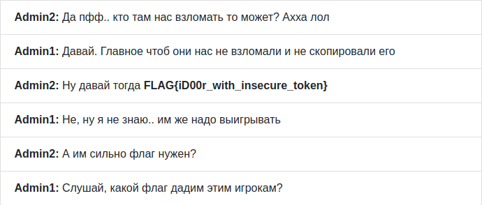

# Door paradox
> Here comes an interesting fact. 221B Baker Street didn’t exist. During the time when the detective was being written, Baker Street was not long and house numbers did not go above 85. The house numbers were written on the front doors of the houses. Although contemporary Museum of Sherlock Holmes has an adresse « 221B Baker Street » it is actually located between house numbers 237 and 241. In reality it’s 239. But let’s go back to the point of the competition. We wrote a messenger for you, because we want you to be comfortable talking. Account for you: test:test


일단 문제 페이지에 접속하고 설명에 제시되어 있는 계정으로 로그인을 했다. 문제에 등록되어 있는 유저는 `Admin1`, `Admin2`, `test`로 총 3명이다. Messages로 가보면 접속한 사용자가 각 유저들에게 남긴 메시지를 볼 수 있다. 페이지 소스 코드를 보니 `script.js` 파일을 확인할 수 있어서 내용을 보며 페이지가 어떻게 구동되는지 파악해보기로 했다. 각각의 기능은 API를 통해 요청이 처리되는 구조였다.

처음에는 다른 사람들이 XSS나 SSTI를 시도하길래 혹시나 해서 SSTI 테스트 구문을 입력해봤지만 의미 있는 결과는 볼 수 없었다. 만약 해당 취약점을 이용하여 푸는 문제라고 한다면 다른 사람들이 입력했던 구문들이 나에게도 영향을 미쳐야 했을 것이다. 스크립트 파일을 계속 보면서 공략할만한 부분을 찾아보려고 했지만 뭔가 캐치하기가 쉽지 않았다. 그래서 페이지가 API와 요청을 어떻게 주고 받는지 파악하기 위해 Burp Suite를 이용했다.

```http
POST /api/users.checkAuth HTTP/1.1
Host: sherlock-message.ru

key=eccbc87e4b5ce2fe28308fd9f2a7baf3
```

일단 페이지를 이동하거나 새로고침 할 때 API에 위와 같은 요청을 보낸다. `key` 파라미터의 값이 32자리의 16진수 값이어서 MD5 일 것 같다는 느낌에 복호화해보니 3이라는 값을 얻을 수 있었다.

```http
POST /api/messages.send HTTP/1.1
Host: sherlock-message.ru

user_id=3&text=hehe&key=eccbc87e4b5ce2fe28308fd9f2a7baf3
```

이것은 메시지를 입력할 때의 요청이다. `user_id`는 메시지를 남길 유저, `text`는 메시지 내용, `key`는 접속한 유저의 정보를 의미하는 것으로 파악하였다.

```http
POST /api/messages.getByDialog HTTP/1.1
Host: sherlock-message.ru

user_id=3&key=eccbc87e4b5ce2fe28308fd9f2a7baf3
```

이것은 메시지 목록을 불러와서 출력하기 위한 요청이다. 각각의 파라미터가 의미하는 것은 바로 위와 동일하다.

인증 체크와 게시물 목록 출력 시에 `key` 값을 조작해보니 두 유저 간의 대화처럼 `test` 이외의 다른 유저의 메시지를 확인할 수 있었다. 이 사이트는 `key` 값을 이용하여 세션과 비슷한 역할을 수행하기 때문에 `Admin1`과 `Admin2`로 접속하기 위해서는 이 `key` 값을 조작해줘야 했다. 위에서 `test`의 `key` 값으로 3을 MD5로 암호화한 값을 이용하였다. 따라서 각각 1과 2를 MD5로 암호화하여 값을 조작해주면 된다.

`test`를 제외한 `Admin1`과 `Admin2`의 대화를 출력하면 뭔가 나오지 않을까 싶어서 `Admin1`의 게시판을 `Admin2`의 `key` 값으로 접속을 시도했다. 그랬더니 플래그 형식으로 보이는 메시지를 볼 수 있었다. 다른 유저들이 입력한 값이 나에게도 보이기 때문에 페이크 플래그일 것 같아서 무시하려고 했다.



그런데 맨 밑으로 내려가보니 다음과 같이 러시아어로 된 대화와 위에서 봤던 플래그가 있었다. 지금은 플래그가 진하게 표시되도록 수정되었지만, 혹시 몰라서 `Admin2`의 게시판을 `Admin1`의 `key` 값으로 접속을 해봤더니 역시 같은 대화와 플래그를 볼 수 있었다. 그래서 이 문제의 플래그로 확신하였고 인증을 통해 점수를 획득하였다.