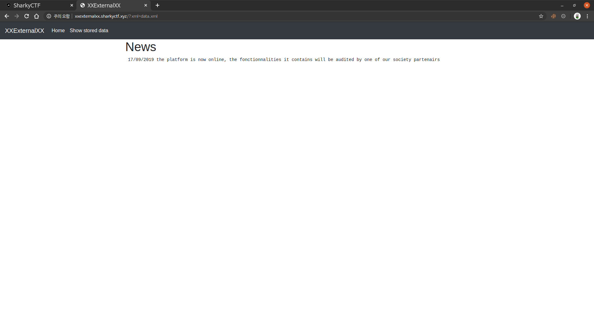
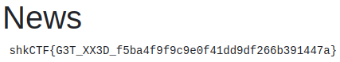

# XXExternalXX
**Web, 70pts**
> One of your customer all proud of his new platform asked you to audit it. To show him that you can get information on his server, he hid a file "flag.txt" at the server's root.
>
> xxexternalxx.sharkyctf.xyz
>
> Creator : Remsio

--------------------------------------------------------------------------------



'Show stored data' 탭으로 이동하면 볼 수 있는 화면이다. URL을 보니 `xml` 파라미터에 `data.xml` 이라는 값이 전달되었다. 서버에서 XML 파일을 읽은 후에 페이지에 출력해주는 것으로 보였다. 해당 파일을 확인해보니 다음과 같은 구조를 가지고 있었다.

```xml
<root>
    <data>17/09/2019 the platform is now online, the fonctionnalities it contains will be audited by one of our society partenairs</data>
</root>
```

**XXE Injection**을 시도하기 위해 서버의 파일을 수정하거나 파일을 업로드할 수 없었기 때문에 외부의 파일을 읽을 수 있는지 확인해봤다. `xml` 파라미터에 내 서버에 저장된 XML 파일의 경로를 전달해보니 내용이 정상적으로 출력되었다. `flag.txt` 파일의 내용을 읽기 위해 다음과 같이 XML 파일을 작성하고 해당 파일의 경로를 전달하여 플래그를 획득하였다.

```xml
<!DOCTYPE root [ <!ENTITY xxe SYSTEM "file:///flag.txt"> ]><root><data>&xxe;</data></root>
```



```
Flag: shkCTF{G3T_XX3D_f5ba4f9f9c9e0f41dd9df266b391447a}
```