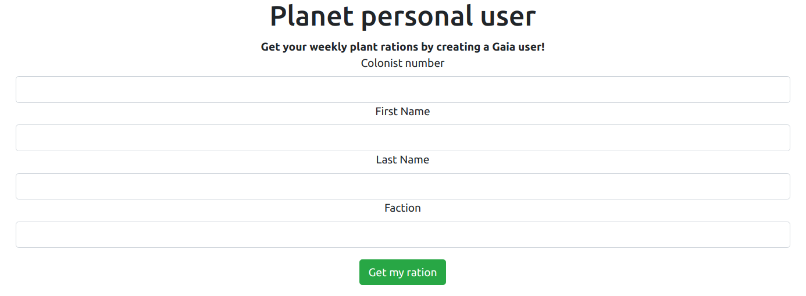

# Redux
**Web, 65pts**
> Here is your Gaia form to get your weekly plant rations. Complete the form and reap your reward!

--------------------------------------------------------------------------------



빈칸을 모두 채우고 아래의 버튼을 눌러봤지만 아무런 반응도 일어나지 않은 것처럼 보였다. 페이지 소스 코드를 보니 스크립트가 복잡하게 작성되어 있었다. 콘솔을 열고 버튼을 눌러보니 아래와 같은 로그가 출력되는 것을 볼 수 있었다.

```
The form has been submitted! Look at the Redux store!
```

해당 로그를 출력시킨 파일을 확인해보니 submit 되는 경우, 콘솔에 로그를 출력시키고 플래그를 어디론가 반환하는 구조로 보였다. 하지만 아래 코드에서 볼 수 있듯이 플래그가 그대로 노출되어 있어서 쉽게 획득할 수 있었다.

```js
import * as types from "../actions/add_form";

const initialState = {
  colonist_number: "",
  first_name: "",
  last_name: "",
  faction: "",
  submitted: ""
};

export const mainReducer = (state = initialState, action) => {
  switch (action.type) {
    case types.ADD_COLONIST_NUMBER:
      console.log("Payload is" + action.payload);
      return { ...state, colonist_number: action.payload };
    case types.ADD_FIRST_NAME:
      return { ...state, firstName: action.payload };
    case types.ADD_LAST_NAME:
      return { ...state, lastName: action.payload };
    case types.ADD_FACTION:
      return { ...state, faction: action.payload };
    case types.SUBMIT_FORM:
      console.log("The form has been submitted! Look at the Redux store!");
      return { ...state, submitted: "TG20{always_disable_redux_dev_tools}" };
    default:
      return state;
  }
};
```

플래그 내용을 보니 `redux` 관리자 도구를 활용하여 디버깅하는 것이 출제자가 의도한 풀이일 것 같다는 생각을 했다.

```
Flag: TG20{always_disable_redux_dev_tools}
```