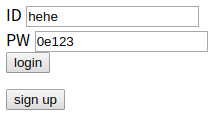
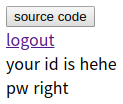
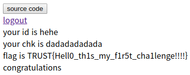

# ezrc
**Web, 150pts**

문제 이름을 보고 바로 Race Condition 문제일 것 같다는 느낌이 들었다. 문제 페이지에 접속하면 로그인과 회원가입을 하는 창이 보인다. 회원가입 후에 로그인을 하니 소스 코드를 확인할 수 있었다.

```php
<?php 
    $id = $_SESSION['id'];
    $res = mysqli_query($con, "select pw from ezrc where id='$id'");
    $idx = mysqli_fetch_array($res);
    $pw = $idx['pw'];

    $print_query = "select chk from ezrc where id='$id'";
    $hehe_query = "update ezrc set chk='$hehe' where id='$id'";
    $reset_query = "update ezrc set chk='nope' where id='$id'";

    echo "<a href=logout.php>logout</a><br/>";
    echo "your id is ".$id."<br/>";
    if(preg_match("/(tata|dada|zaza)+[a-z]{3}+coco?hehe/", $_GET['key']) && strlen($_GET['key'])>30){
        $res = mysqli_query($con, $print_query);
        $idx = mysqli_fetch_array($res);
        echo "your chk is ".$idx['chk']."<br/>";        
        if($idx['chk'] == $hehe){
            echo $flag."<br/>";
            mysqli_query($con, $reset_query);
            exit("congratulations");
        }
    }
    mysqli_query($con, $hehe_query);
    $str = "trust_is_very_cooool";
    $t = (int)$_GET['times'];
    if($pw == md5(240610708)){
        echo "pw right";
        for($i=0; $i<$t; $i=$i+1){
            for($j=0; $j<$t; $j=$j+1){
                $str = md5($str);
            }
        }
        if($str == "d91a2796ab967c9793ef1c628a91fac5"){
            echo $flag;
        }
        else{
            mysqli_query($con, $reset_query);
        }
    }
    else{
        mysqli_query($con, $reset_query);
    }
?>
```

처음에는 해시 값이 일치해도 플래그를 출력하길래 스크립트를 작성해서 해시 값을 알아내려고 했다. 그런데 생각해보니 실행 시간이 너무 오래 걸리기 때문에 이 부분을 이용하여 Race Condition을 발생시키면 되는 문제였다.

플래그를 획득하기 위해서는 `hehe_query`가 실행되고 나서 바로 `chk` 값이 `hehe`와 비교되어야 한다. 그러기 위해서는 먼저 `pw`가 `240610708`을 MD5로 암호화한 값과 일치해야 한다. `md5(240610708)`는 매직해시이므로 `pw`를 0이 되는 지수 표현으로 설정하고 로그인하면 된다.




다음은 Race Condition을 발생시키기 위해 GET 방식으로 `times` 파라미터에 적당히 큰 정수 값을 넘겨 `md5` 함수를 `t*t`번 실행하도록 만든다. 그러면 연산을 수행하는 동안에는 다음 코드로 넘어가지 않기 때문에 `chk`는 `hehe` 값과 동일하다. 그리고 다른 브라우저를 통해 새로운 세션으로 접속한 후, GET 방식으로 `key` 파라미터에 30자를 초과하고 `/(tata|dada|zaza)+[a-z]{3}+coco?hehe/`와 같은 정규 표현식을 만족하는 값을 넘겨주면 조건문을 만족하여 플래그가 출력된다.



**TRUST{Hell0_th1s_my_f1r5t_cha1lenge!!!!}**