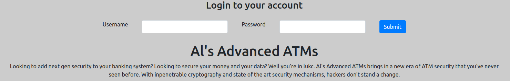

# Al's Advanced ATMs
**Web, 100pts**
> Al says his advanced ATMs are impenetrable. I'm not so sure...
>
> http://159.89.228.183:8087
>
> Author: t0pc4r

--------------------------------------------------------------------------------



로그인 창을 보고 인증을 우회하는 문제인가 싶었는데, 페이지 타이틀이 `React App`이라서 문제 페이지를 구성하는 JS 파일을 확인했다.

```js
var w = function() {
    return r.a.createElement("div", {
        className: "center"
    }, r.a.createElement("h1", null, "Super Secret Database"), r.a.createElement(y.a, null, r.a.createElement("thead", null, r.a.createElement("tr", null, r.a.createElement("th", null, "Username"), r.a.createElement("th", null, "Password"))), r.a.createElement("tbody", null, r.a.createElement("tr", null, r.a.createElement("td", null, "root"), r.a.createElement("td", null, "dG9vcg==")), r.a.createElement("tr", null, r.a.createElement("td", null, "admin"), r.a.createElement("td", null, "YWRtaW4=")), r.a.createElement("tr", null, r.a.createElement("td", null, "user"), r.a.createElement("td", null, "cGFzc3dvcmQ=")), r.a.createElement("tr", null, r.a.createElement("td", null, "umd-csec"), r.a.createElement("td", null, "VU1EQ1RGLXtvcDNuX2RAdEBfYjY0X2JAZH0=")), r.a.createElement("tr", null, r.a.createElement("td", null, "AzureDiamond"), r.a.createElement("td", null, "SHVudGVyMg==")))))
};
```

그중에서 `Super Secret Database` 라는 이름을 가진 부분이 눈에 띄었다. `Username`과 `Password`가 저장되어 있어서 base64 인코딩되어 있는 값들 중에서 가장 긴 것을 디코딩 해보니 플래그를 획득할 수 있었다.

나중에 다른 write-up을 보니 위에서 읽었던 코드들이 각각의 파일들로 작동하고 이것들을 관리자 도구에서 확인할 수 있다는 것을 알았다. `React`가 어떻게 동작하는지 알았다면 조금 더 쉽게 접근할 수 있었을 것 같다.

```
Flag: UMDCTF-{op3n_d@t@_b64_b@d}
```