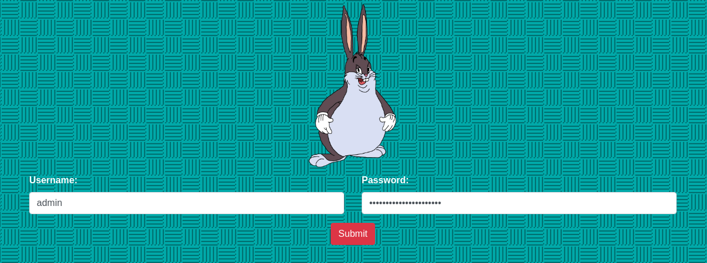
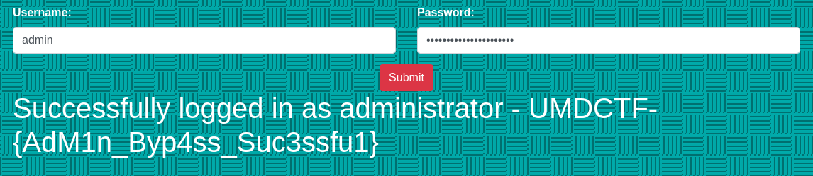

# Chungus Vault 2.0
**Web, 200pts**
> We found out the username and password of an administrator, but can't log in to the site as an administrator. Can you figure out what is going on?
>
> http://159.89.228.183:8088
>
> Author: WittsEnd2

--------------------------------------------------------------------------------



`Username`과 `Password`가 입력되어 있어서 버튼을 눌러보니 `user`로 로그인 되었다는 메시지가 출력되었다. 난독화된 `main.js` 파일이 있어서 정리한 후에 Submit 버튼을 누를 때 작동하는 부분을 확인했다.

```js
var k = $('check')['val']();
if (k === 'e9b7a334826ff2ff28b066a92ba8734cb1134720fc5879592247f47b8d2a17d7') {
    if (b('0x61', 'Ar(v') === b('0x43', '1o1K')) {
        $('#message')['text']('Successfully logged in as user');
    }
    
    ...

} else if (k === 'dd668f583f3cc97929dc8bba5090c143b579314bfb7d32888febd09015e65b85') {
    $('#message')['text']('Successfully logged in as administrator - UMDCTF-{AdM1n_Byp4ss_Suc3ssfu1}');
}

...
```

버튼을 눌렀을 때 작동하는 함수의 일부를 읽을 수 있도록 수정한 것이다. `#check`의 값과 비교하여 출력하는 내용이 달라진다는 것을 알 수 있다. 원래 `hidden` 타입의 `input` 태그 안에 `if`에서 비교하는 값이 숨어 있는데, 이것을 `else if`에서 비교하는 값으로 바꾼 다음에 버튼을 누르면 플래그가 화면에 출력되는 것이다.



```
Flag: UMDCTF-{AdM1n_Byp4ss_Suc3ssfu1}
```