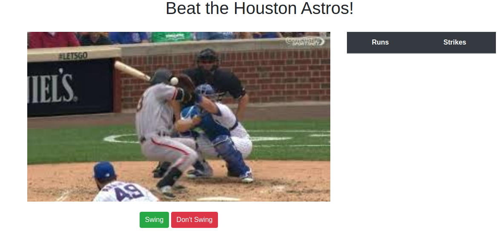

# SignStealingSoftware-P4
**Web, 300pts**
> We now have everything we need. Let's play ball and beat the Astros at their own game!
>
> http://159.89.228.183:8083
>
> Author: WittsEnd2

----------



시작 버튼을 누르면 위와 같이 사진이 나오고 상황에 맞게 버튼을 눌러 점수를 획득하는 게임이 실행된다. 일정 시간이 지나면 게임은 종료된다. 나의 경험상 보통 이런 식으로 문제가 나오면 일반적으로 획득할 수 없는 점수를 달성해야 플래그가 출력되는 경우가 많았다. 그래서 `main.js` 파일을 보며 플래그를 획득할 수 있는 조건을 확인해보기로 했다.

```js
if (o >= 0x2710 && q !== !![] && p < 0x3) {
    $(b('0x5e', '0Fx['))['css'](b('0x5', 'kp1I'), b('0x26', '%%aV'));
    $(b('0x9a', 'yGY9'))[b('0x85', 'E!v3')](b('0x16', 'DNRm'), b('0xab', 'ek2C'));
    $(b('0x98', 'DNRm'))['html'](b('0x7f', 'g&ck'));
}
```

위의 코드는 시작 버튼을 누르고 10초 후에 실행되는 함수의 일부이다. 세 가지 값을 비교하는 것으로 보아 이 부분이 플래그를 출력해줄 것으로 예상되었다. 이해할 수 있도록 수정하면 다음과 같다.

```js
if (o >= 10000 && q !== !![] && p < 3) {
    $('#gameDiv')['css']('display', 'none');
    $('#winDiv')['css']('display', 'block');
    $('#showScore')['html']('<p>UMDCTF-{H0Ust0N_L0sT_4t_Th31r_@wN_G@m3}</p>');
}
```

그렇게 플래그를 획득할 수 있었다. 아마 10000점을 획득하면 화면에 플래그가 출력될 것으로 보인다.

```
Flag: UMDCTF-{H0Ust0N_L0sT_4t_Th31r_@wN_G@m3}
```