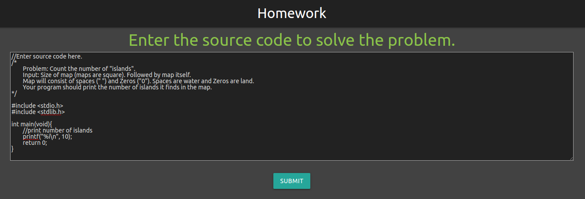
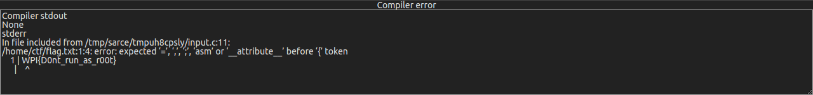

# autograder
**Web, 100pts**
> A prof made a little homework grader at https://autograder.wpictf.xyz/ but I heard he is hiding a flag at /home/ctf/flag.txt
>
> made by: awg and rm -k

--------------------------------------------------------------------------------



C로 작성된 코드가 있고 버튼을 누르면 실행 결과가 하단에 출력된다. 이와 비슷한 문제를 최근에 풀어봤기 때문에 풀이가 바로 떠올랐다. 플래그 파일을 `include` 하면 정상적인 헤더 파일이 아니기 때문에 컴파일 오류가 발생하면서 파일의 내용이 출력된다. 따라서 아래와 같이 코드 한 줄만 추가하여 플래그를 획득할 수 있었다.

```c
#include </home/ctf/flag.txt>
```



```
Flag: WPI{D0nt_run_as_r00t}
```