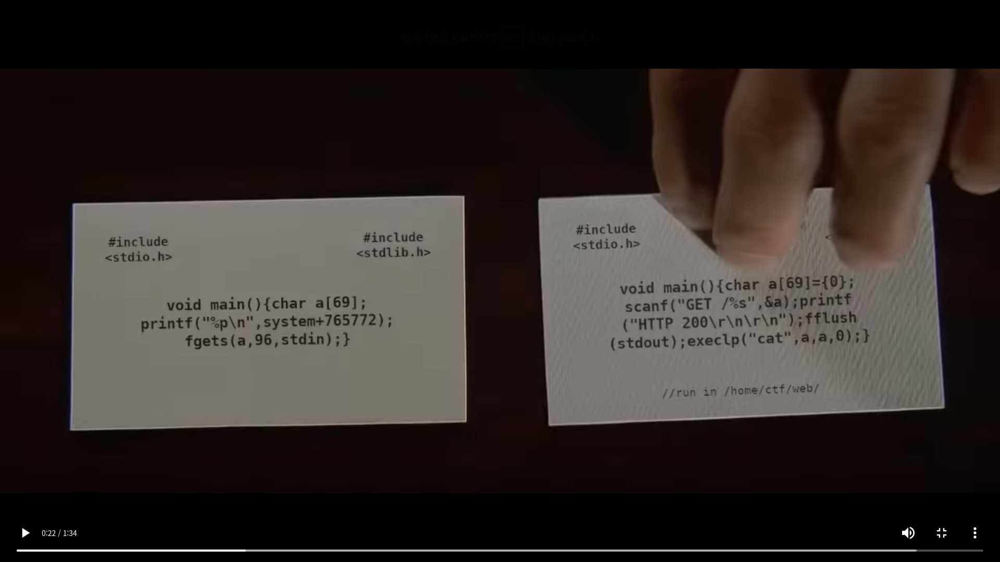

# dorsia2
**Web, 50pts**
> http://us-east-1.linodeobjects.com/wpictf-challenge-files/dorsia.webm The second card.
>
> http://dorsia2.wpictf.xyz:31337/index.html or 31338 or 31339
>
> Firefox doesnt like the page... try chromium.
>
> made by: awg
>
> Hint: flag in ~/flag.txt

--------------------------------------------------------------------------------



사진에 보이는 두 번째 카드가 이 문제에서 제공하는 [코드](dorsia2.c)이다.

```c
#include <stdio.h>

void main() {
	char a[69] = {0};
	scanf("GET /%s", &a);
	printf("HTTP 200\r\n\r\n");
	fflush(stdout);
	execlp("cat", a, a, 0);
}

//run in /home/ctf/web/
```

요청하는 파일을 `cat` 명령어로 출력해주는 구조로 보인다. 힌트를 보면 플래그가 홈 디렉토리에 있는데 프로그램이 홈 디렉토리의 하위 디렉토리에서 실행되고 있다. 따라서 `/home/ctf/flag.txt`에 접근하기 위해서는 `../flag.txt`로 요청을 보내야 했다.

그런데 `curl`로 `../flag.txt`에 요청을 보냈지만 플래그가 출력되지 않았다. 크롬 브라우저에서 똑같이 요청을 보내봤는데 자동으로 `flag.txt`로 변환하여 요청을 보내는 것을 볼 수 있었다. 그래서 프록시 툴을 사용하여 요청을 보내니 플래그를 획득할 수 있었다.

```
Flag: WPI{1_H4VE_2_return_SOME_VIDE0TAP3S}
```