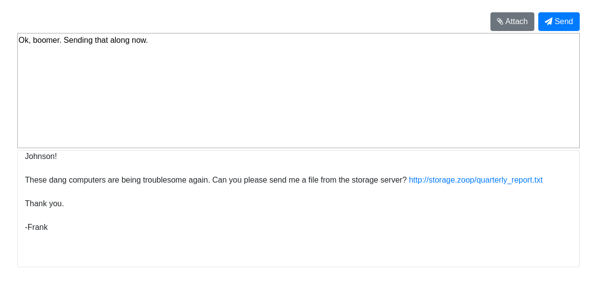
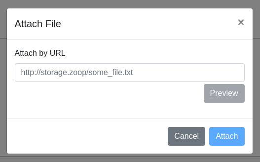
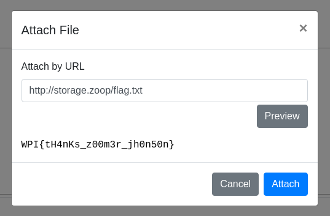

# zoop
**Web, 50pts**
> 👈😎👈Zoop👉😎👉Zoop 👈😎👈Zoop👉😎👉...
> 
> http://zoop.wpictf.xyz
>
> made by: ollien

--------------------------------------------------------------------------------



파일을 첨부하여 메시지를 보낼 수 있을 것으로 보인다.



쿠키를 탈취할 수 있는 파일을 첨부하여 메시지를 보내봤는데 서버에 저장된 값이 없었다. 그래서 페이지가 어떻게 작동되는지 확인하기 위해 JS [파일](zoop.js)을 살펴봤다.

```js
$('#send').click(() => {
	$('#send-indicator').css('visibility', 'visible');
	$('#send-indicator').css('opacity', 1);
    $('#big-textbox').attr('disabled', true);
	$('#attach').attr('disabled', true);
});
```

전송 버튼을 눌렀을 때 작동하는 부분이다. 상대방에게 메시지가 전송되거나 하는 역할을 하지 않는다는 것을 알 수 있었다. 그래서 메인에 적혀 있는 파일을 미리보기 해봤더니 그 파일의 내용이 출력되었다. 해당 서버에 플래그 파일이 있는지 확인해보니 아래와 같이 플래그를 획득할 수 있었다.



```
Flag: WPI{tH4nKs_z00m3r_jh0n50n}
```