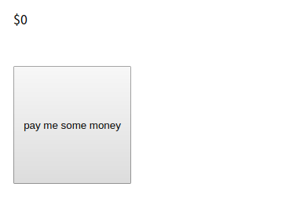

# Consolation
**Web, 50pts**
> I've been feeling down lately... Cheer me up!

----------------------------------------



메인 화면에 보이는 버튼을 누르면 25달러씩 더해진다. 페이지 소스 코드를 보니 `iftenmillionfireflies.js` 파일이 스크립트로 작동하고 있었다. 코드가 난독화되어 있어서 JavaScript Beautifier를 이용하여 읽을 수 있도록 만들었다. 버튼을 누를 때 작동하는 `nofret` 함수를 확인해보니 다음과 같았다.

```js
function nofret() {
    document[_0x4229('0x95', 'kY1#')](_0x4229('0x9', 'kY1#'))[_0x4229('0x32', 'yblQ')] = parseInt(document[_0x4229('0x5e', 'xtR2')](_0x4229('0x2d', 'uCq1'))['innerHTML']) + 0x19;
    console[_0x4229('0x14', '70CK')](_0x4229('0x38', 'rwU*'));
    console['clear']();
}
```

아직 어떤 동작을 하는지 이해하기 어렵기 때문에 콘솔 창에서 함수를 실행시켜 코드를 수정하였다.

```js
function nofret() {
    document['getElementById']('monet')['innerHTML'] = parseInt(document['getElementById']('monet')['innerHTML']) + 0x19;
    console['log']('actf{you_would_n0t_beli3ve_your_eyes}');
    console['clear']();
}
```

버튼을 누를 때마다 숫자를 25씩 더하고 콘솔 창에 플래그를 출력한 다음에 콘솔 창을 초기화한다는 것을 알 수 있다.

```
actf{you_would_n0t_beli3ve_your_eyes}
```