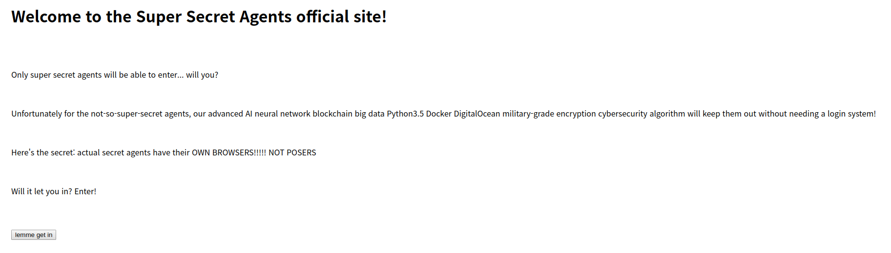
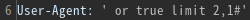
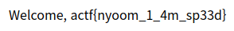

# Secret Agents
**Web, 110pts**
> Can you enter the secret agent portal? I've heard someone has a flag :eyes:
> 
> Our insider leaked the source, but was "terminated" shortly thereafter...

----------------------------------------



문제 이름에서 User-Agent 관련 문제라는 느낌이 들었다. 제공된 [코드](app.py)를 보니 SQL Injection을 통해 플래그를 획득해야 할 것으로 보였다. 버튼을 눌렀을 때 실행되는 스크립트를 요약하면 다음과 같다.

```python
@app.route("/login")
def login():
    u = request.headers.get("User-Agent")

    ...

    for r in cursor.execute("SELECT * FROM Agents WHERE UA='%s'"%(u), multi=True):
		if r.with_rows:
			res = r.fetchall()
			break
    
    ...

    if len(res) == 0:
		return render_template("login.html", msg="stop! you're not allowed in here >:)")

	if len(res) > 1:
		return render_template("login.html", msg="hey! close, but no bananananananananana!!!! (there are many secret agents of course)")

	return render_template("login.html", msg="Welcome, %s"%(res[0][0]))
```

일단 조건절을 참으로 만들어주기 위해 프록시 툴을 이용하여 User-Agent에 `' or true#'`를 입력하여 `/login`에 요청을 보냈다. 그러면 결과가 여러 개 반환되기 때문에 두 번째 if문이 실행된다. 그래서 뒤에 `limit 0,1`을 추가하여 결과가 하나씩만 나오도록 하였다. 그렇게 세 번째 레코드에서 플래그를 획득할 수 있었다.

  


```
actf{nyoom_1_4m_sp33d}
```