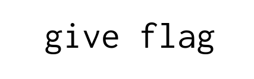

# The Magic Word
**Web, 20pts**
> Ask and you shall receive...that is as long as you use the magic word.

----------------------------------------



메인에 **give flag** 라고만 적혀 있어서 소스 코드를 보니 아래와 같은 스크립트가 있었다.

```js
var msg = document.getElementById("magic");
setInterval(function() {
    if (magic.innerText == "please give flag") {
        fetch("/flag?msg=" + encodeURIComponent(msg.innerText))
            .then(res => res.text())
            .then(txt => magic.innerText = txt.split``.map(v => String.fromCharCode(v.charCodeAt(0) ^ 0xf)).join``);
    }
}, 1000);
```

`magic`의 내용을 **please give flag**로 만들면 플래그가 화면에 출력된다.


```
actf{1nsp3c7_3l3m3nt_is_y0ur_b3st_fri3nd}
```