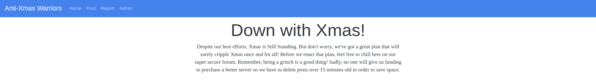
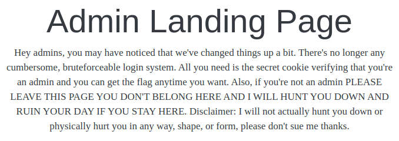
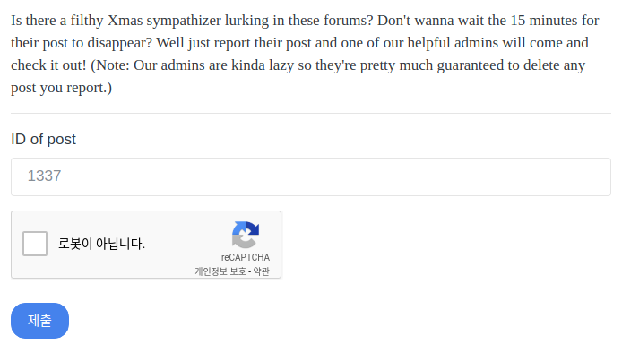
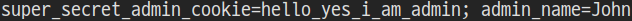
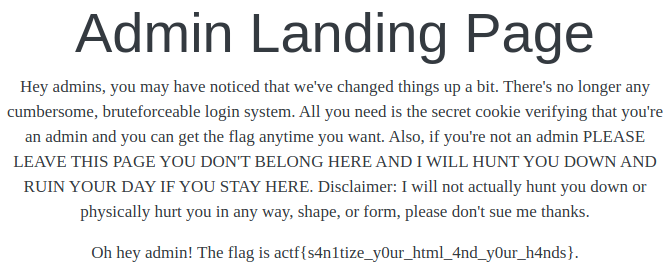

# Xmas Still Stands
**Web, 50pts**
> You remember when I said I dropped clam's tables? Well that was on Xmas day. And because I ruined his Xmas, he created the Anti Xmas Warriors to try to ruin everybody's Xmas. Despite his best efforts, Xmas Still Stands. But, he did manage to get a flag and put it on his site. Can you get it?

----------------------------------------



문제 페이지에 접속하면 위와 같은 화면을 볼 수 있다.



Admin 페이지를 보면 플래그를 획득하기 위해서 관리자의 쿠키 값을 탈취해야 한다는 것을 알 수 있다.



Report 페이지에서 게시물 번호를 제출하면 관리자가 해당 게시물을 확인하기 때문에 쿠키 값을 획득할 수 있도록 Post 페이지에서 XSS 페이로드를 게시물로 작성하면 된다. 쿠키 값을 저장하기 위해서 개인 서버에 PHP 파일을 만들고 해당 파일로 접속하도록 하였다. 확인해보니 `<script>` 태그는 필터링 되기 때문에 `` 태그를 사용하여 페이로드를 작성하였다.

```html

```



서버에 저장된 파일을 보면 위와 같이 관리자의 쿠키를 확인할 수 있다. 획득한 쿠키 값을 브라우저에 저장하고 Admin 페이지에 접속하면 플래그를 획득할 수 있다.



```
actf{s4n1tize_y0ur_html_4nd_y0ur_h4nds}
```