# XSS game
https://xss-game.appspot.com/

## Level 1: Hello, world of XSS
### Mission Description
This level demonstrates a common cause of cross-site scripting where user input is directly included in the page without proper escaping.

Interact with the vulnerable application window below and find a way to make it execute JavaScript of your choosing. You can take actions inside the vulnerable window or directly edit its URL bar.

### Mission Objective
Inject a script to pop up a JavaScript alert() in the frame below.

Once you show the alert you will be able to advance to the next level.

### Exploit
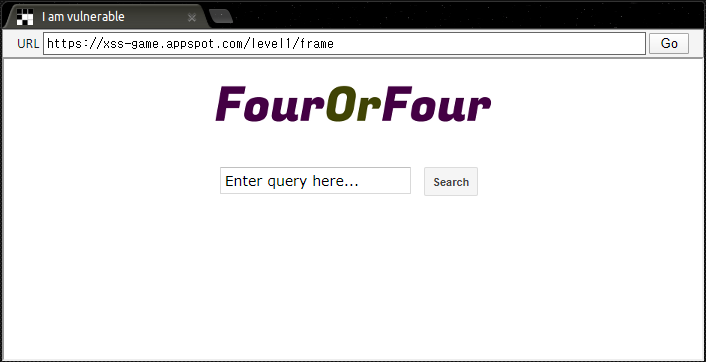

메인 화면을 보면 쿼리를 입력할 수 있는 입력창이 있다.

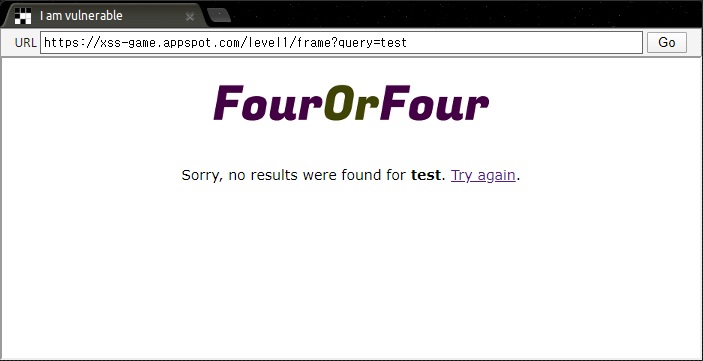
```html
<body id="level1">
    
    <div>
    Sorry, no results were found for <b>test</b>. <a href='?'>Try again</a>.
    </div>
</body>
```
사용자가 내용을 입력하여 요청을 보냈을 때, 입력한 내용이 파라미터를 통해 페이지에 그대로 출력되고 `<b>` 태그 사이에 삽입되는 것으로 보아, **Reflected XSS**의 발생 가능성을 확인할 수 있다.

`query` 파라미터의 값에 `<script>alert("Level 1")</script>` 를 입력하여 아래와 같이 XSS를 발생시켜 문제를 해결하였다.

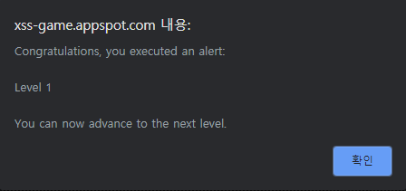

---

## Level 2: Persistence is key
### Mission Description
Web applications often keep user data in server-side and, increasingly, client-side databases and later display it to users. No matter where such user-controlled data comes from, it should be handled carefully.

This level shows how easily XSS bugs can be introduced in complex apps.

### Mission Objective
Inject a script to pop up an `alert()` in the context of the application.

**Note**: the application saves your posts so if you sneak in code to execute the alert, this level will be solved every time you reload it.

### Exploit
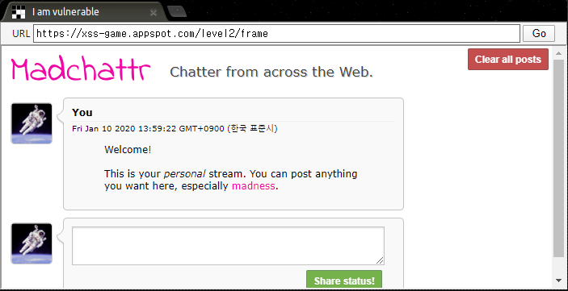

사용자가 입력한 내용이 게시물로 등록되는 형식의 사이트이다.

```js
function displayPosts() {
    var containerEl = document.getElementById("post-container");
    containerEl.innerHTML = "";

    var posts = DB.getPosts();
    for (var i=0; i<posts.length; i++) {
        var html = '<table class="message"> <tr> <td valign=top> '
        + ' </td> <td valign=top '
        + ' class="message-container"> <div class="shim"></div>';

        html += '<b>You</b>';
        html += '<span class="date">' + new Date(posts[i].date) + '</span>';
        html += "<blockquote>" + posts[i].message + "</blockquote";
        html += "</td></tr></table>"
        containerEl.innerHTML += html; 
    }
}
```
게시물이 등록되는 함수를 보면 입력한 내용이 `<blockquote>` 태그 사이에 삽입되어 저장되기 때문에 **Stored XSS**가 발생할 수 있을 것으로 보인다.

**Level 1**처럼 스크립트 태그로 삽입했는데 XSS가 발생하지 않아서 `` 와 같이 입력하여 게시물을 등록하였더니 XSS가 발생하였다.

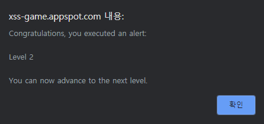

---

## Level 3: That sinking feeling...
### Mission Description
As you've seen in the previous level, some common JS functions are execution sinks which means that they will cause the browser to execute any scripts that appear in their input. Sometimes this fact is hidden by higher-level APIs which use one of these functions under the hood.

The application on this level is using one such hidden sink.

### Mission Objective
As before, inject a script to pop up a JavaScript `alert()` in the app.

Since you can't enter your payload anywhere in the application, you will have to manually edit the address in the URL bar below.

### Exploit
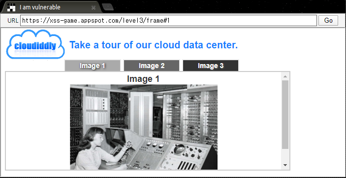

이미지를 볼 수 있는 버튼이 있고, 각 버튼을 누르면 URL의 `#` 뒤의 숫자가 변경되어 다른 이미지가 출력된다.

```js
function chooseTab(num) {
    // Dynamically load the appropriate image.
    var html = "Image " + parseInt(num) + "<br>";
    html += "";
    $('#tabContent').html(html);
 
    window.location.hash = num;

    ...
}
```
위의 소스 코드는 이미지 선택 함수의 일부분이다. 각 버튼을 눌렀을 때 `num` 파라미터에 숫자가 전달되어 `cloud1.jpg` 와 같이 이미지 파일이 선택되는 방식이다. 여기서 이미지가 로딩되었을 때 `alert()` 함수가 호출되도록 하여 XSS를 발생시킬 수 있다.

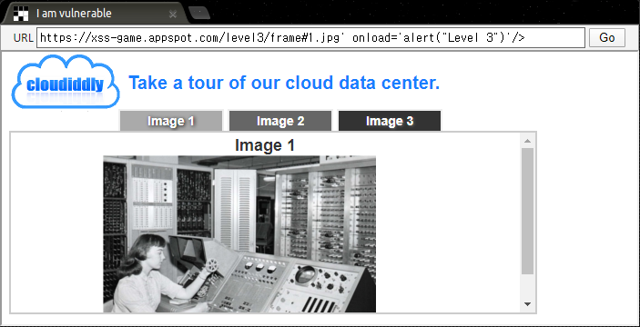


---

## Level 4: Context matters
### Mission Description
Every bit of user-supplied data must be correctly escaped for the context of the page in which it will appear. This level shows why.

### Mission Objective
Inject a script to pop up a JavaScript `alert()` in the application.

### Exploit
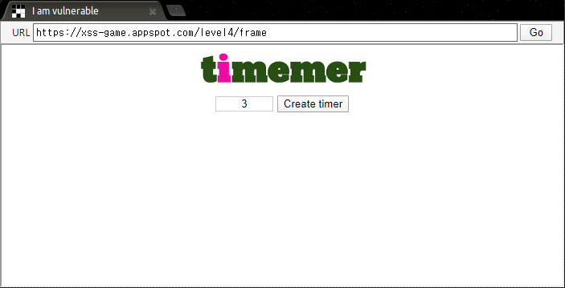

버튼을 누르면 입력한 시간이 지난 후에 알림이 호출된다. 입력한 숫자는 `timer` 파라미터의 값으로 넘겨져 요청이 처리된다.

```html
<body id="level4">
    
    <br>
    
    <br>
    <div id="message">Your timer will execute in {{ timer }} seconds.</div>
</body>
```
소스 코드를 보면 입력한 값이 `timer` 파라미터를 통해 `` 태그의 속성으로 삽입될 수 있음을 확인할 수 있다. 그래서 `onload` 핸들러에 `alert()` 함수를 추가하여 XSS가 발생할 수 있도록 해보았다.

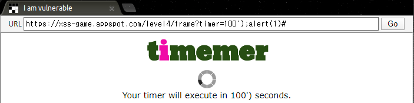

```html
<body id="level4">
    
    <br>
    
    <br>
    <div id="message">Your timer will execute in 100&#39;) seconds.</div>
</body>
```
그런데 작은 따옴표는 인코딩되고 세미콜론 뒤에 입력되는 내용은 필터링되는 것을 확인할 수 있다. 사실 이 부분에서 막혀서 힌트를 봤지만 별로 도움이 되는 느낌은 아니여서 풀이를 참고하였다.

다시 보니 나는 태그를 닫아서 완성시키려고 했는데 필터링되는 문자가 많아서 점점 꼬였던 거 같다. 그냥 닫는 싱글쿼터를 활용하여 `alert()` 함수를 완성시키면 됐는데 너무 복잡하게 생각했다.

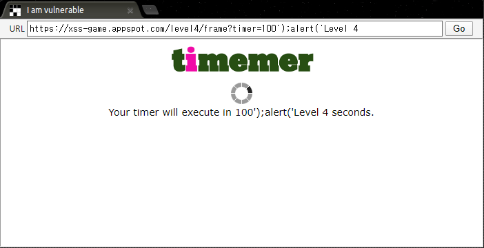

세미콜론을 그대로 입력하면 문장 종료로 처리하는지 뒤에 문자열이 무시돼서 URL 인코딩하여 입력하였더니 XSS가 발생하여 문제를 해결할 수 있었다.


---

## Level 5: Breaking protocol
### Mission Description
Cross-site scripting isn't just about correctly escaping data. Sometimes, attackers can do bad things even without injecting new elements into the DOM.

### Mission Objective
Inject a script to pop up an `alert()` in the context of the application.

### Exploit
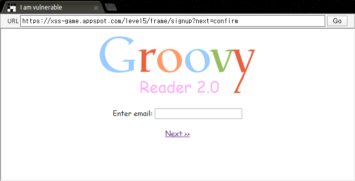

첫 화면에서 회원가입 링크를 누르면 위의 사진과 같은 페이지로 이동된다.

```html
<a href="{{ next }}">Next >></a>
```
소스 코드를 보면 `next` 파라미터에 넘겨진 값으로 이동하는 링크가 생성되는 것을 확인할 수 있다. 그래서 `href` 속성을 닫고 `onclick` 핸들러로 `alert()` 함수를 호출시키려고 했는데 특수문자가 인코딩되어서 그런지 작동하지 않았다.

하단의 힌트를 열어서 보니 `onclick` 핸들러를 사용하지 않고 링크를 클릭했을 때 자바스크립트를 작동시킬 수 있는 방법을 알아내야 했다. 그래서 힌트에 첨부되어 있는 문서를 읽어보았다.

```html
<a href='javascript:doSomething()'>...</a>
```
`href` 속성에 위와 같이 입력하면 링크를 클릭했을 때 `doSomething()` 위치의 함수가 작동한다는 설명이 있었다. 그래서 `alert()` 함수를 입력했더니 아래와 같이 정상적으로 작동하는 것을 확인할 수 있었다.

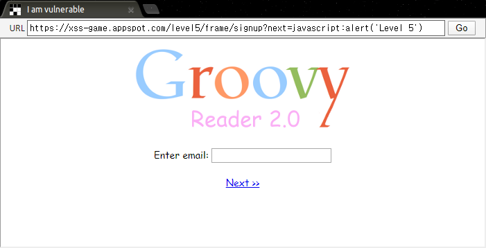


---

## Level 6: Follow the 🐇
### Mission Description
Complex web applications sometimes have the capability to dynamically load JavaScript libraries based on the value of their URL parameters or part of `location.hash`.

This is very tricky to get right -- allowing user input to influence the URL when loading scripts or other potentially dangerous types of data such as `XMLHttpRequest` often leads to serious vulnerabilities.

### Mission Objective
Find a way to make the application request an external file which will cause it to execute an `alert()`.

### Exploit
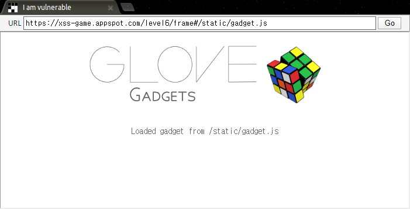

```js
function includeGadget(url) {
    var scriptEl = document.createElement('script');
    ...
    // Load this awesome gadget
    scriptEl.src = url;
    ...
}

// Take the value after # and use it as the gadget filename.
function getGadgetName() { 
    return window.location.hash.substr(1) || "/static/gadget.js";
}
```
위는 소스 코드의 일부분이다. 소스 코드를 보니 `#` 뒤에 입력한 위치에서 해당 파일을 불러와 스크립트를 작동시키는 구조이다. 나는 처음에 다른 문제와 비슷하게 접근하려고 했다. 그런데 어디에도 스크립트를 삽입할 곳이 없었기 때문에 한참을 헤맸다.

힌트를 봤는데 설명은 다음과 같았다.

```
If you can't easily host your own evil JS file, see if google.com/jsapi?callback=foo will help you here.
```
외부에서 파일을 불러오지 못하면 해당 문서를 확인해보라는 내용이다. 여기서 외부 서버에서 파일을 불러와야 한다는 것을 깨달았다. 하지만 외부에서 내 서버에 접속할 수 있도록 설정을 하지 않아서 당장은 어려웠다. 그래서 다른 방법을 이용하기 위해 해당 경로에 들어가봤는데 소스 코드만 빼곡할 뿐, 무엇을 의미하는지는 감이 잡히지 않았다.

풀이를 보니 `callback` 파라미터에 입력된 이름으로 함수가 최하단에 작성되었다. 그래서 `alert`를 입력하면 `alert()` 함수가 만들어졌다. 그렇게 `#` 뒤에 입력하면 해당 경로의 파일을 불러와 스크립트를 작동시킬 수 있었다. 이때 `http` 문자열이 필터링되기 때문에 대문자로 우회하여 요청을 보내야 정상적으로 작동한다.

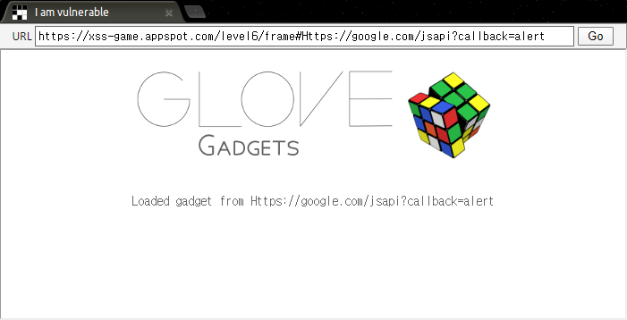

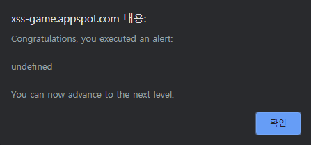

---

## Clear
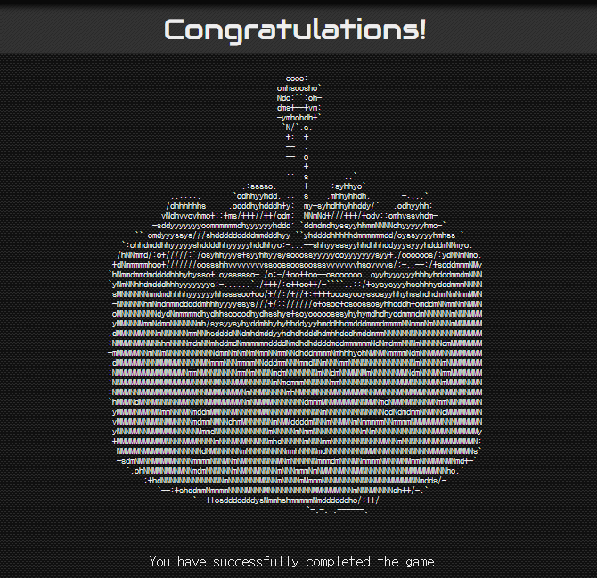

*스스로 너무 답답해서 서둘러 푼다고 하다가 깊이 생각하지 못한 것이 후회된다.*